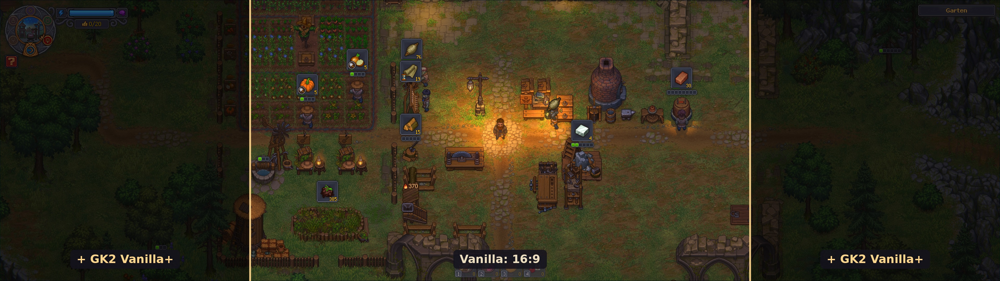
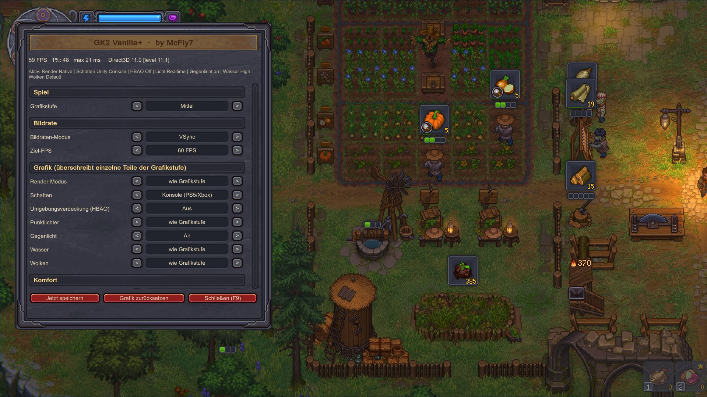

# GK2 Vanilla+

**Ultrawide, performance & quality of life for Graveyard Keeper 2 – the game stays vanilla.**
by **McFly7** · [Download](https://github.com/Matshio7/gk2-vanilla-plus/releases/latest)

**[English](#english) · [Deutsch](#deutsch)**

---

## English

GK2 Vanilla+ improves the PC version of Graveyard Keeper 2 without changing the game itself: no gameplay changes, no game files touched, save games stay compatible with the unmodded game. Uninstall it and the game is exactly as before.

### Features

**Ultrawide**
- Unlocks 21:9 and 32:9 resolutions (2560×1080, 3440×1440, 3840×1080, 5120×1440, …) that the game hides
- Fills the sides of the main menu on ultrawide screens with a blurred copy of the menu image

**Performance** – the game has more graphics switches internally than its menu shows. The mod menu (F9) exposes them:
- Shadows (soft PC shadows or the cheaper console shadows), ambient occlusion (HBAO), point lights, back light, water, clouds, render mode
- Frame rate cap or VSync with a target FPS (e.g. a locked 60), physics rate, log spam filter
- Useful on any monitor, especially on laptops, handhelds and Macs

**Quality of life**
- Mod menu in the game's own look (F9), German and English
- FPS display (F10): pick the corner and what to show – FPS, 1% low, frame time, CPU, GPU, RAM, VRAM, resolution, clock
- "Save now" button and optional save key, extra autosave timer
- Camera zoom, pause when the window is in the background, skip intro logos
- Update check with one-click update (Windows)

### Install (Windows)

1. Download `GK2-VanillaPlus-<version>.zip` from [Releases](https://github.com/Matshio7/gk2-vanilla-plus/releases/latest) and extract it.
2. Run `Installieren.bat`. If SmartScreen warns: *More info* → *Run anyway*.
3. The game folder is found automatically. Click **Install** and start the game via Steam.

**Updating:** in game, the mod menu (F9) shows new versions – *Save & update* does the rest. Or run the installer again: *Check online for updates*.

**Uninstall:** run the installer → *Uninstall* (optionally removes BepInEx too).

### macOS (CrossOver) / Linux (Proton, Steam Deck)

Copy the contents of `installer/files` into the game folder and set the DLL override `winhttp` to *native, builtin* (CrossOver: Wine configuration → Libraries; Proton: launch option `WINEDLLOVERRIDES="winhttp=n,b" %command%`). The mod menu then also offers a **controller fix** against stutter with PlayStation controllers under Wine.

### Mod packs

You may include GK2 Vanilla+ **unmodified** in free mod packs, with credit and the license file. Modifying it or removing the credits is not allowed. See [LICENSE.md](LICENSE.md).

### Building

See [docs/BUILDING.md](docs/BUILDING.md). The game's own assemblies are not part of this repository.

---

## Deutsch

GK2 Vanilla+ verbessert die PC-Version von Graveyard Keeper 2, ohne das Spiel selbst zu verändern: kein anderes Gameplay, keine Spieldateien angefasst, Spielstände bleiben mit dem Originalspiel kompatibel. Nach dem Deinstallieren ist das Spiel wieder genau wie vorher.

### Funktionen

**Ultrawide**
- Schaltet 21:9- und 32:9-Auflösungen frei (2560×1080, 3440×1440, 3840×1080, 5120×1440, …), die das Spiel versteckt
- Füllt auf Ultrawide-Bildschirmen die Seiten des Hauptmenüs mit einer unscharfen Kopie des Menübilds

**Leistung** – das Spiel hat intern mehr Grafik-Schalter, als das Menü zeigt. Das Mod-Menü (F9) macht sie zugänglich:
- Schatten (weiche PC-Schatten oder die sparsameren Konsolen-Schatten), Umgebungsverdeckung (HBAO), Punktlichter, Gegenlicht, Wasser, Wolken, Render-Modus
- Bildraten-Limit oder VSync mit Ziel-FPS (z. B. stabile 60), Physik-Takt, Filter gegen Log-Spam
- Hilft auf jedem Monitor, besonders auf Laptops, Handhelds und Macs

**Komfort**
- Mod-Menü in der Optik des Spiels (F9), Deutsch und Englisch
- FPS-Anzeige (F10): Ecke und Inhalt wählbar – FPS, 1%-Low, Frametime, CPU, GPU, RAM, VRAM, Auflösung, Uhrzeit
- Button „Jetzt speichern“ und optionale Speichern-Taste, zusätzlicher Autosave
- Kamera-Zoom, Pause im Hintergrund, Intro-Logos überspringen
- Update-Prüfung mit Ein-Klick-Update (Windows)

### Installation (Windows)

1. `GK2-VanillaPlus-<Version>.zip` unter [Releases](https://github.com/Matshio7/gk2-vanilla-plus/releases/latest) laden und entpacken.
2. `Installieren.bat` starten. Falls SmartScreen warnt: *Weitere Informationen* → *Trotzdem ausführen*.
3. Der Spielordner wird automatisch gefunden. **Installieren** klicken und das Spiel über Steam starten.

**Aktualisieren:** Im Spiel zeigt das Mod-Menü (F9) neue Versionen an – *Speichern & aktualisieren* erledigt den Rest. Oder den Installer erneut starten: *Online nach Updates suchen*.

**Deinstallieren:** Installer starten → *Deinstallieren* (auf Wunsch samt BepInEx).

### macOS (CrossOver) / Linux (Proton, Steam Deck)

Den Inhalt von `installer/files` in den Spielordner kopieren und die DLL-Überschreibung `winhttp` auf *nativ, builtin* stellen (CrossOver: Wine-Konfiguration → Bibliotheken; Proton: Startoption `WINEDLLOVERRIDES="winhttp=n,b" %command%`). Im Mod-Menü gibt es dann zusätzlich den **Controller-Fix** gegen Ruckler mit PlayStation-Controllern unter Wine.

### Modpacks

GK2 Vanilla+ darf **unverändert** in kostenlose Modpacks aufgenommen werden, mit Namensnennung und Lizenzdatei. Verändern oder Credits entfernen ist nicht erlaubt. Siehe [LICENSE.md](LICENSE.md).

---

GK2 Vanilla+ is a fan project, not affiliated with Lazy Bear Games or tinyBuild.
