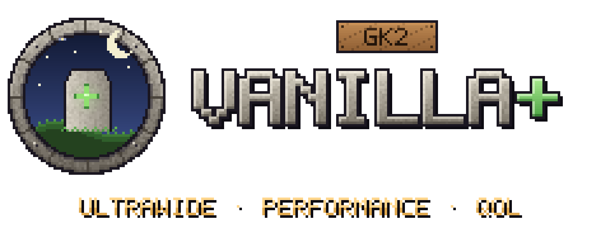
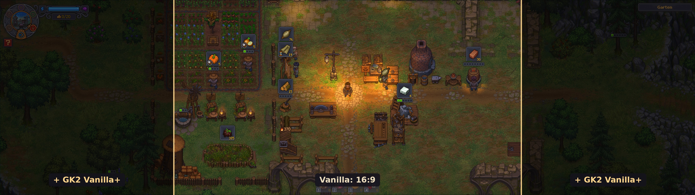
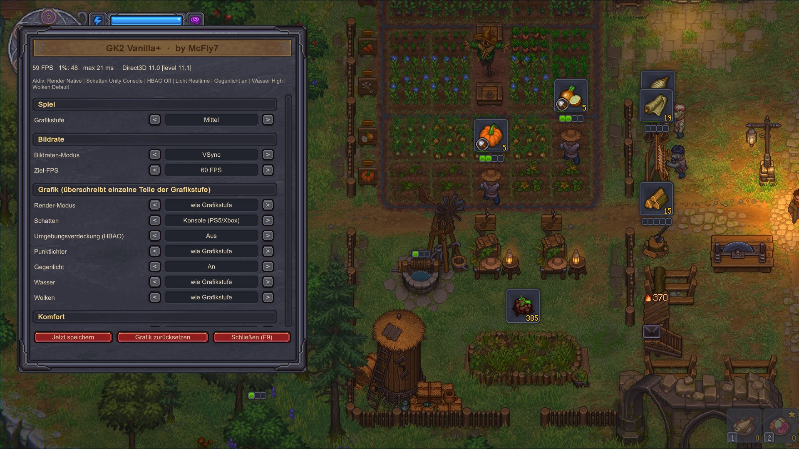

# GK2 Vanilla+

**Ultrawide, performance & quality of life for Graveyard Keeper 2 – the game stays vanilla.**
by **McFly7** · [Steam Workshop](https://steamcommunity.com/sharedfiles/filedetails/?id=3808053878) · [Download](https://github.com/Matshio7/gk2-vanilla-plus/releases/latest) · [Changelog](docs/CHANGELOG.md)

**[English](#english) · [Deutsch](#deutsch)**

---

## English

GK2 Vanilla+ fixes the small annoyances of Graveyard Keeper 2 without changing how it plays: no balance changes, no game files touched, saves stay compatible with the unmodded game. Every feature has its own switch – **All off (vanilla)** turns everything off, then enable just what you want. If another mod does the same job, Vanilla+ steps aside for that part.

### Features

**Comfort**
- **Pinning** – recipes, blueprints, town buildings, blockages, quests, town orders and alchemy recipes. A small list shows have/need for every ingredient, the ingredient tree, fuel and recipe variants; craft 2–10× and all amounts scale. Left click the pin – or set your own key or mouse button.
- **Trade the right amount** – the vendor slider starts at exactly the amount that still gives a thumbs up; "Add liked goods" puts them all in at once.
- **Max button** when crafting, **rename zombies**, **week plan** (F6) with a spoiler-free daily reminder
- Day & time in the area box, Esc / B leaves conversations, faster doors & map travel, instant removal

**Performance**
- Hidden graphics settings: shadows, ambient occlusion, lights, water, clouds, render mode, physics rate
- One-click profiles (Steam Deck / Battery, Performance, Quality), FPS cap and VSync, less rain for weak PCs
- **Benchmark** that tests all graphics tiers and recommends one
- **FPS display** (F10): FPS, 1% low, CPU, GPU, RAM, VRAM, GPU temp, clock

**Screen**
- **Ultrawide 21:9 & 32:9** (2560×1080, 3440×1440, 3840×1080, 5120×1440, …) incl. main menu, HUD and full-width rain
- **Main menu backgrounds** – six Vanilla+ pictures or your own view from your save, with styles, blur and drifting fog
- OLED black, hide HUD (F7), HUD to center, skip intro logos
- Camera zoom presets (F5), zoom indoors, mouse wheel; **hi-res screenshots** (F12) up to 4×

**Saves**
- Save overview in the main menu, **automatic backups** with one-click restore, keep important backups forever, an extra backup when a battle starts, extra autosave

**Controller** – the whole mod menu and the pinned list work with a gamepad. Made for Steam Deck.

**Optional, not fully vanilla (off by default):** move objects, full refund when removing buildings, refund talents & research.

Languages: English, German, French, Spanish, Portuguese, Russian, Chinese – more via a text file.

### Install (Windows)

1. **Steam Workshop:** [Subscribe](https://steamcommunity.com/sharedfiles/filedetails/?id=3808053878) and open `<Steam library>\steamapps\workshop\content\4358690\3808053878`.
   **GitHub:** download `GK2-VanillaPlus-<version>.zip` from [Releases](https://github.com/Matshio7/gk2-vanilla-plus/releases/latest) and extract it.
2. Run `Installieren.bat`. If SmartScreen warns: *More info* → *Run anyway*.
3. The game folder is found automatically. Choose **Stable** (recommended, tested) or **Beta** (newest features from GitHub, may contain bugs), click **Install** and start the game via Steam.
4. In game: **F9** or the **Vanilla+** button opens the mod menu.

**Updating:** the mod menu shows new versions – *Save & update* does the rest. Switch between Stable and Beta under *Update channel*.

**Uninstall:** run the installer → *Uninstall* → *Remove everything* (incl. BepInEx, game back to original) or *Vanilla+ only*. The mod's backups and screenshots are kept in `Documents\GK2 Vanilla+`.

### macOS (CrossOver) / Linux / Steam Deck (Proton)

Copy the contents of `installer/files` into the game folder and set the DLL override `winhttp` to *native, builtin* (CrossOver: Wine configuration → Libraries; Proton: launch option `WINEDLLOVERRIDES="winhttp=n,b" %command%`). Step-by-step guide in the Steam Workshop Discussions tab.

### Bugs & ideas

Steam Workshop Discussions or [GitHub Issues](https://github.com/Matshio7/gk2-vanilla-plus/issues) – for bugs please attach `BepInEx\LogOutput.log`.

### Mod packs

You may include GK2 Vanilla+ **unmodified** in free mod packs, with credit and the license file. Modifying it or removing the credits is not allowed. See [LICENSE.md](LICENSE.md).

### Building

See [docs/BUILDING.md](docs/BUILDING.md). The game's own assemblies are not part of this repository.

---

## Deutsch

GK2 Vanilla+ behebt die kleinen Ärgernisse von Graveyard Keeper 2, ohne das Spielgefühl zu ändern: keine Balance-Änderungen, keine Spieldateien angefasst, Spielstände bleiben mit dem Originalspiel kompatibel. Jede Funktion hat einen eigenen Schalter – **Alles aus (Vanilla)** schaltet alles ab, danach nur das einschalten, was du willst. Macht ein anderer Mod dasselbe, hält sich Vanilla+ bei diesem Teil raus.

### Funktionen

**Komfort**
- **Anpinnen** – Rezepte, Baupläne, Stadtgebäude, Blockaden, Quests, Stadtaufträge und Alchemie-Rezepte. Eine kleine Liste zeigt Haben/Brauchen für jede Zutat, den Zutatenbaum, Brennstoff und Rezeptvarianten; 2–10× herstellen und alle Mengen passen sich an. Linksklick auf die Nadel – oder eine eigene Taste bzw. Maustaste.
- **Passende Menge beim Handeln** – der Regler startet genau bei der Menge, die noch einen Daumen hoch gibt; „Daumen-hoch-Waren einlegen“ legt alle auf einmal hinein.
- **Max-Knopf** beim Herstellen, **Zombies umbenennen**, **Wochenplan** (F6) mit spoilerfreier Tagesübersicht
- Tag & Uhrzeit im Gebietsfeld, Esc / B beendet Gespräche, schnellere Türen & Kartenreisen, sofortiges Abbauen

**Leistung**
- Versteckte Grafikoptionen: Schatten, Umgebungsverdeckung, Lichter, Wasser, Wolken, Render-Modus, Physik-Takt
- Profile mit einem Klick (Steam Deck / Akku, Leistung, Qualität), FPS-Limit und VSync, weniger Regen für schwache PCs
- **Benchmark**, der alle Grafikstufen testet und eine empfiehlt
- **FPS-Anzeige** (F10): FPS, 1%-Low, CPU, GPU, RAM, VRAM, GPU-Temperatur, Uhrzeit

**Bild**
- **Ultrawide 21:9 & 32:9** (2560×1080, 3440×1440, 3840×1080, 5120×1440, …) inkl. Hauptmenü, HUD und Regen über die volle Breite
- **Hauptmenü-Hintergründe** – sechs Vanilla+-Bilder oder deine eigene Ansicht aus dem Spielstand, mit Stilen, Unschärfe und Nebel
- OLED-Schwarz, HUD ausblenden (F7), HUD mittig, Intro-Logos überspringen
- Zoom-Stufen (F5), Zoom in Innenräumen, Mausrad; **Screenshots** (F12) in bis zu 4-facher Auflösung

**Spielstände**
- Übersicht im Hauptmenü, **automatische Backups** mit Wiederherstellen per Klick, wichtige Backups dauerhaft behalten, zusätzliches Backup bei Kampfbeginn, zusätzlicher Autosave

**Controller** – das ganze Mod-Menü und die Pin-Liste funktionieren mit dem Gamepad. Gemacht für das Steam Deck.

**Optional, nicht ganz Vanilla (standardmäßig aus):** Objekte verschieben, volle Erstattung beim Abbauen, Talente & Forschung zurückerstatten.

Sprachen: Deutsch, Englisch, Französisch, Spanisch, Portugiesisch, Russisch, Chinesisch – weitere per Textdatei.

### Installation (Windows)

1. **Steam Workshop:** [Abonnieren](https://steamcommunity.com/sharedfiles/filedetails/?id=3808053878) und `<Steam-Bibliothek>\steamapps\workshop\content\4358690\3808053878` öffnen.
   **GitHub:** `GK2-VanillaPlus-<Version>.zip` unter [Releases](https://github.com/Matshio7/gk2-vanilla-plus/releases/latest) laden und entpacken.
2. `Installieren.bat` starten. Falls SmartScreen warnt: *Weitere Informationen* → *Trotzdem ausführen*.
3. Der Spielordner wird automatisch gefunden. **Stabil** (empfohlen, getestet) oder **Beta** (neueste Funktionen von GitHub, kann Fehler enthalten) wählen, **Installieren** klicken und das Spiel über Steam starten.
4. Im Spiel: **F9** oder der Knopf **Vanilla+** öffnet das Mod-Menü.

**Aktualisieren:** Das Mod-Menü zeigt neue Versionen an – *Speichern & aktualisieren* erledigt den Rest. Zwischen Stabil und Beta wechselst du unter *Update-Kanal*.

**Deinstallieren:** Installer starten → *Deinstallieren* → *Alles entfernen* (samt BepInEx, Spiel wieder original) oder *Nur Vanilla+*. Backups und Screenshots des Mods bleiben unter `Dokumente\GK2 Vanilla+` erhalten.

### macOS (CrossOver) / Linux / Steam Deck (Proton)

Den Inhalt von `installer/files` in den Spielordner kopieren und die DLL-Überschreibung `winhttp` auf *nativ, builtin* stellen (CrossOver: Wine-Konfiguration → Bibliotheken; Proton: Startoption `WINEDLLOVERRIDES="winhttp=n,b" %command%`). Schritt-für-Schritt-Anleitung im Diskussionen-Tab des Steam Workshops.

### Fehler & Ideen

Diskussionen im Steam Workshop oder [GitHub Issues](https://github.com/Matshio7/gk2-vanilla-plus/issues) – bei Fehlern bitte `BepInEx\LogOutput.log` anhängen.

### Modpacks

GK2 Vanilla+ darf **unverändert** in kostenlose Modpacks aufgenommen werden, mit Namensnennung und Lizenzdatei. Verändern oder Credits entfernen ist nicht erlaubt. Siehe [LICENSE.md](LICENSE.md).

---

Some features were inspired by "Recipe Pin" (farfars), "Daily Reminder" (MrsKiraSayers), "GK2 Ultrawide Rain Fix" (Dry Bones), "What time is it", "ESC to Leave" (OrionAF), "Instant Transitions" (LeBetoven) and "Talent & Tech Refund" – own implementation.

GK2 Vanilla+ is a fan project, not affiliated with Lazy Bear Games or tinyBuild.
